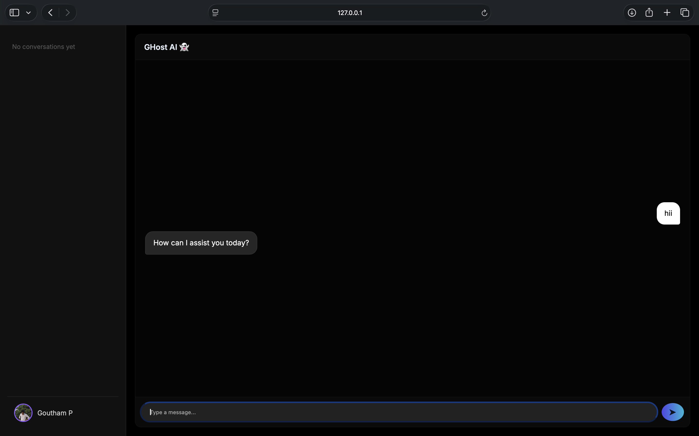
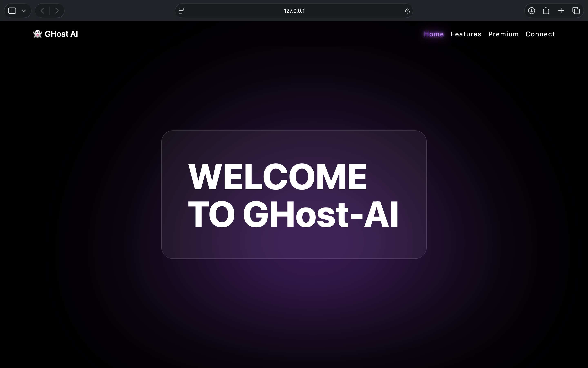
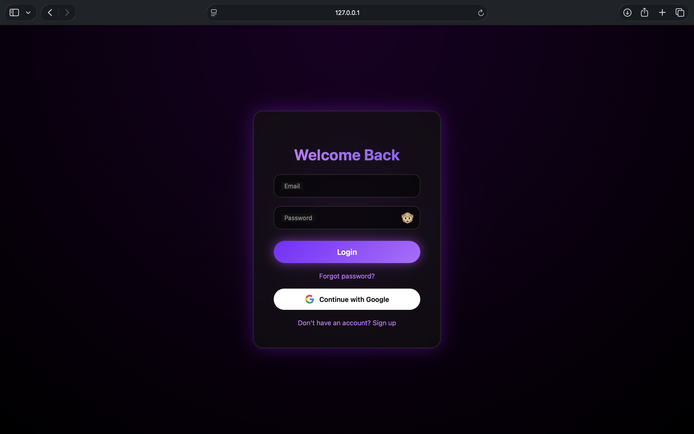

# 👻 Ghost AI Chatbot

A web-based AI chatbot application that interacts with users and provides intelligent responses.

## 🚀 Features
- Real-time chatbot interaction
- Clean and responsive UI
- User authentication system
- Integrated backend logic
- Secure environment handling

## 🛠 Tech Stack
- Frontend: HTML, CSS, JavaScript
- Backend: Python (Flask)
- Database: Firebase
- APIs: AI & authentication integrations
## 📸 Screenshots

### 💬 Chat Interface


### 🏠 Home Page


### 🔐 Login Page


### 🔐 Login Page


## ⚙️ Installation

1. Clone the repository
```bash
git clone https://github.com/gouthampalivela21/ghost-ai.git
cd ghost-ai
